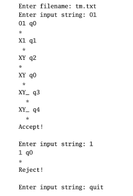

# Turning Machine

The goal of this project is to write a program that simulates Turing Machines. The Turing Machines will begiven in text files of the same format as used by https://turingmachinesimulator.com/.  

The program should work like this:  
Ask the user to enter a filename. Then repeatedly ask them for input strings. The user enters quit when they want to stop. After each input string is entered, the program will display every step the machine runs through, showing the contents of the tape, the current state, and the location of the read head. Display whether the string is accepted or rejected.  

See below:  

**Details on the input file format**  
Input files have a format like shown below:  
name: TM  
init: q0  
accept: q1  
q0,0q0,X,>  
q0,1q1,1,>  

The first line contains the name of the program. The next two lines contain the initial and accepting statenames. You can assume these lines will always start withname:,init:, and accept:. 
 
Transitions are specified on two lines, with entries on each line separated by commas. The first line containsthe current state and the tape symbol at the current read head location. The second line contains the new state, the symbol to overwrite on the tape, and <or> indicating whether to move the read head left or right.  
 
Further details about the file format and program: 
• You can assume transitions are separated by blank lines. 
• Whitespace within each line should be ignored. 
• The blank symbol is an underscore,_. 
• You can assume that the tape alphabet symbols are single characters. 
• There is no restriction on the state names in terms of how long they are or what characters they contain, except that they can’t contain whitespace or commas. 
• Assume that the tape has no left or right end. Blanks are assumed to be on the tape everywhere that hasn’t been written.

** The project instruction where cerated by Dr. Heinold for the class Theory of Computation.

#### Build With
• Python 

#### Authors
Angela Raymond - Solution to the project.  
Dr. Heinold - Project instructions.

#### License
This project is licensed under the MIT license, Copyright (c) 2018 Maximilian Stoiber. For more information see LICENSE.md.
